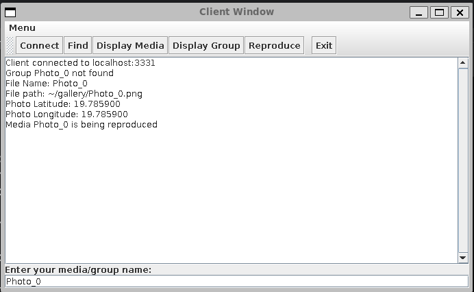

# Travaux Pratiques de Paradigmes de Programmation

Auteur: Raynner Schnneider Carvalho
Cours: Paradigmes de Programmation - INF224
Date: 2023-11-19

## Travaux Pratiques C++/Objet

### Description

Ce projet consiste en la conception d'une application multimédia en C++, avec une interface graphique Java Swing. Voici un résumé des principales étapes du développement :

**1. Démarrage :** Un répertoire de travail a été créé avec les fichiers Makefile et main.cpp. Le Makefile gère la compilation et l'exécution du programme.

**2. Classe de base :** La classe de base pour les objets multimédias a été définie avec des constructeurs, des destructeurs, des accesseurs et des modifieurs.

**3. Programme de test :** Un programme de test a été écrit pour vérifier le bon fonctionnement de la classe de base.

**4. Photos et vidéos :** Deux sous-classes, PhotoObject et VideoObject, ont été implémentées. La classe de base est maintenant abstraite avec une méthode reproduceMedia.

**5. Traitement uniforme:** Le polymorphisme a été utilisé pour traiter de manière uniforme une liste de photos et de vidéos.

**6. Films et tableaux :** Une sous-classe FilmObject a été créée, ajoutant la possibilité d'avoir des chapitres dans les vidéos.

**7. Destruction et copie des objets :** Des modifications ont été apportées pour éviter les fuites mémoire lors de la destruction des objets.

**8. Créer des groupes :** Une classe GroupObject a été ajoutée pour contenir un groupe d'objets multimédias. Les objets peuvent appartenir à plusieurs groupes.

**9. Gestion automatique de la mémoire :** La classe GroupObject utilise désormais des pointeurs intelligents (`std::shared_ptr`) pour une gestion automatique de la mémoire.

**10. Gestion cohérente des données :** La classe ManagerObject a été créée pour fabriquer et manipuler tous les objets de manière cohérente.

**11. Client/Serveur :** Le programme C++ a été transformé en un serveur qui communique avec un client agissant comme une télécommande. Un protocole de communication simple a été défini en ```protocolCom.cpp```.

Le programme propose des fonctionnalités telles que la lecture, la recherche, la suppression, l'affichage de groupes et de multimédias, l'ajout de vidéos et de photos, ainsi que la gestion automatique de la mémoire.

### Compilation et exécution

Pour compiler et exécuter le programme, il suffit d'exécuter la commande suivante :

```bash
cd cpp/
make run
```

## Travaux Pratiques Java/Swing

### Description

Une interface graphique Java Swing (ClientWindow.java) a été développée pour interagir avec le programme C++ en utilisant le protocole défini.

Il est possible de se connecter à un serveur, de rechercher des multimédias et des groupes, d'afficher des multimédias et des groupes et aussi de jouer des multimédias. Le multimédia a déjà été ajouté au serveur via principal et il est uniquement possible de visualiser les médias : Photo_0 et Video_1.

L'image suivante montre l'interface graphique du client :



### Compilation et exécution

Pour compiler et exécuter le programme, il suffit d'exécuter la commande suivante :

```bash
cd swing/
make run
```